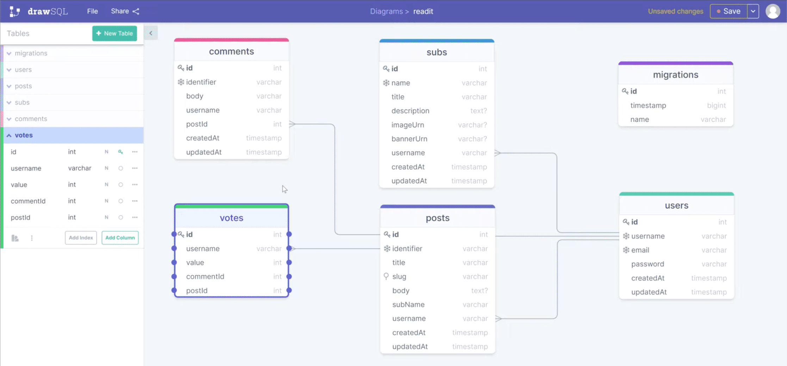

# Reddit Clone

> `Nextjs` `TypeORM` `TailwindCSS` `TypeScript` `[Classsed]`

## Notes

- `yarn add ts-node@latest @types/node@latest typescript@latest`
- `yarn add express`
- `yarn add -D @types/express`
- `yarn add class-validator`

### class-validator

```ts
// ---- entity ----
import { IsEmail, Min } from "class-validator";

@Entity("users")
export class User extends BaseEntity {
  constructor(user: Partial<User>) {
    super();
    Object.assign(this, user);
  }
  @Index()
  @IsEmail()
  @Column({ unique: true })
  email: string;

  @Index()
  @Min(3)
  @Column({ unique: true })
  username: string;

  @Column()
  @Min(6)
  password: string;
}

// ---- routes ----
const user = new User({ email, username, password });
// 在 entity 上定义 class-validate 生成的装饰器，可以喂给自己 “吃”
const errors = await validate(user);
if (errors.length > 0) return res.status(400).json({ errors });
```

> 为什么 typeORM 那么好用 ？

```ts
@Entity("users")
export class User extends BaseEntity {
  constructor(user: Partial<User>) {
    super();
    Object.assign(this, user);
  }

  @Exclude()
  @PrimaryGeneratedColumn()
  id: number;

  @Index()
  @IsEmail()
  @Column({ unique: true })
  email: string;

  @Index()
  @Length(3, 32, { message: "用户名最少为三个字符" })
  @Column({ unique: true })
  username: string;

  @Exclude()
  @Column()
  @Length(6, 32)
  password: string;

  @CreateDateColumn()
  createdAt: Date;

  @UpdateDateColumn()
  updatedAt: Date;

  @BeforeInsert()
  async hashPassword() {
    this.password = await bcrypt.hash(this.password, 6);
  }

  toJSON() {
    return classToPlain(this);
  }
}
```

- `npm i jsonwebtoken cookie cookie-parser dotenv`
- `npm i -D @types/jsonwebtoken @types/cookie @types/cookie-parser`

#### 数据库

- `npm run typeorm entity:create -- --name Post`
- `npm run typeorm schema:drop`
- `npm run typeorm migration:generate -- --name create-users-table`

```ts
import {
  BeforeInsert,
  Column,
  Entity,
  Index,
  JoinColumn,
  ManyToOne,
} from "typeorm";
import { BaseEntity } from "typeorm";
import { makeId } from "../utils/helpers";
import Post from "./Post";
import User from "./User";

@Entity("comments")
class Comment extends BaseEntity {
  constructor(comment: Partial<Comment>) {
    super();
    Object.assign(this, comment);
  }

  @Index()
  @Column()
  identifier: string;

  @Column()
  body: string;

  @Column()
  username: string;

  @ManyToOne(() => User)
  @JoinColumn({ name: "username", referencedColumnName: "username" })
  user: User;

  @ManyToOne(() => Post, (post) => post.comments)
  post: Post;

  @BeforeInsert()
  makeId() {
    this.identifier = makeId(8);
  }
}

export default Comment;
```

> - 当关闭了同步 `"synchronize": false`，而新建了一个 `Entity` 时，主动 `npm run typeorm migration:generate -- --name create-comments-table`
> - 然后就可以执行 sql 了：`npm run typeorm migration:run`
> - 最后如果发现刚创建的表有些字段没配置好，且没有写入数据时，可以进行 `revert` 恢复操作，然后修改字段，然后重新 `generate` 和 `run`
>   - 特别注意，revert 操作会先删表，因为原操作是创建表，然后删 migrations 的该行记录
>   - 如果已经同步到线上，就不能这样搞，只能再生成一个新的 migration 操作
>   - `npm run typeorm migration:revert`
>   - 把原 `xxxxxxx-create-comments-table.ts` 先删除，因为数据库 `migrations` 里已经删除该记录，一定先确认！
>   - `npm run typeorm migration:generate -- --name create-comments-table`
>   - `npm run typeorm migration:run`
>   - 最后再检查下 数据库的 `migrations` 里到和文件夹内的文件是否一一对应

```ts
// 修改 Entity 字段
@ManyToOne(() => Post, (post) => post.comments, { nullable: false })
post: Post;
```

- 开启跨域 + 开启 cookie
- `npm i -S cors`

```js
// 前端
Axios.defaults.withCredentials = true;
```

```js
// 后端
app.use(
  cors({
    credentials: true,
    origin: process.env.ORIGIN,
    optionsSuccessStatus: 200,
  })
);

// 写入 cookie
res.set(
  "Set-Cookie",
  cookie.serialize("token", token, {
    httpOnly: true,
    secure: process.env.NODE_ENV === "production",
    sameSite: "strict",
    maxAge: 3600,
    path: "/",
  })
);
```

```ts
// 类似 mongoose 的虚拟字段，但感觉一股面向对象的味道
// Entity/Post.ts
@Expose() get url(): string {
  return `/r/${this.subName}/${this.identifier}/${this.slug}`;
}

// protected url: string;
// @AfterLoad()
// createField() {
//   this.url = `/r/${this.subName}/${this.identifier}/${this.slug}`;
// }
```



```ts
import { Entity, Column, ManyToOne, JoinColumn } from "typeorm";
import Comment from "./Comment";
import BaseEntity from "./Entity";
import Post from "./Post";
import User from "./User";

@Entity("votes")
export default class Vote extends BaseEntity {
  constructor(vote: Partial<Vote>) {
    super();
    Object.assign(this, vote);
  }

  @Column()
  value: number;

  @ManyToOne(() => User)
  @JoinColumn({ name: "username", referencedColumnName: "username" })
  user: User;

  @Column()
  username: string;

  @ManyToOne(() => Post)
  post: Post;

  @ManyToOne(() => Comment)
  comment: Comment;
}
```

- `npm run typeorm migration:generate -- --name create-votes-table`
- `npm run typeorm migration:run`

- **关于 vote 时是否用写的事务，还是用读的计算**
  - 如果单机系统开事务就算了，如果分布式还是读的计算吧

```ts
// ---- Entity/Post.ts ----
// ! 这里的意思就是把所有和这个帖子相关的vote取出来，后面计算用
@OneToMany(() => Vote, (Vote) => Vote.post)
votes: Vote[];

@Expose() get url(): string {
  return `/r/${this.subName}/${this.identifier}/${this.slug}`;
}

@Expose() get commentCount(): number {
  return this.comments?.length;
}

// ! 计算帖子的得分，有些人1、有些人-1 ...
@Expose() get voteScore(): number {
  return this.votes?.reduce((memo, curt) => memo + (curt.value || 0), 0);
}
```

> - 某些敏感表，不用 `userId` 外链，而是用加了索引的 `username` 外联，非常巧啊
> - 另外这里计算voteScore时，把 **`写复杂`** 降维到 **`读复杂`**，很有味道啊
> - 很有　🐗🐗🐗 “野猪书”🐗🐗🐗 　的感觉

- `写复杂`时，需要并行多个事务来解决写问题 ！！！

```ts
// for example:
await getConnection().transaction(async (tm) => {
  await tm.query(
    `
    insert into updoot ("userId", "postId", value)
    values ($1, $2, $3);
  `,
    [userId, postId, value]
  );

  await tm.query(
    `
    update post
    set points = points + $1
    where id = $2;
  `,
    [value, postId]
  );
});
```

- 面向对象的威力

```js
// Entity/Post.ts  | Comment.ts 也有
protected userVote: number;

setUserVote(user: User) {
  // 传进来的 user 是 res.locals.user
  // * 你到底是顶了一下还是踩了一下
  const index = this.votes?.findIndex((v) => v.username === user.username);
  this.userVote = index > -1 ? this.votes[index].value : 0;
}
```

```js
//
const vote = async (req: Request, res: Response) => {
  // ...
  const user: User = res.locals.user;
  post.setUserVote(user);
  post.comments.forEach((c) => c.setUserVote(user));
  // ...
};
```

> 有的时候，为了统筹前后端，可以两端一起考虑重构。
>
> 例如 `/api/posts -- getPosts` 接口，需要考虑 `有token` 和 `无token` 区分，`有token` 就 `set` 当前用户的 `vote` 操作结果，那此时可以考虑将原 `authMiddleware` 中间件做的两件事拆分：
>
> - 拆分成做两件事的中间件：前一个只拿 `token` 换 `User`，后一个只强制检查 `User` 即可
> - 充分利用面向对象的充血模型，把 `Entity` 写得成富有 **`“数据”`** 流动型，这也符合人脑的单核思维模式 —— 把相关的事务放一起考虑。
> - 虽然原来做C#搞做面向对象，但后来做node和前端后，淡化了很多面向对象，实则也不怎么喜欢，后来就一直用 `FP` 的多。今天这个业务的小场景，把 `OOP` 面向对象的本质 **`“一个对象是拥有状态和行为的”`** 凸显的非常形象，也感觉到了它的魅力，真的感受到了对象的有了数据的流动，感受到它是个有 `血有肉的模型`。
> - 再次感受到《微服务架构设计模式》中所提到的 `“没有银弹”` 的观点，只有最合适，没有最好！

- typeorm-seeding `npm i -D typeorm-seeding`
  - `/src/seeds/create-fake-data.ts`
  - `ormconfig.json` - `"seeds": ["src/seeds/**/*{.ts,.js}"],`
  - `package.json` - `"seed": "ts-node ./node_modules/typeorm-seeding/dist/cli.js seed"`
  - `npm run seed` 执行所有 `seeds` 下文件

* * *

### Client

- `npx create-next-app client`
- `yarn add --dev typescript @types/react @types/node`
- `touch tsconfig.json` 后再 `yarn dev` 会自动填入配置文件

- 修改 `_app.js` -> `_app.ts`

```typescript
import { AppProps } from "next/app";

function App({ Component, pageProps }: AppProps) {
  return <Component {...pageProps} />;
}

export default App;
```

- `yarn add tailwindcss@latest postcss@latest autoprefixer@latest`
- `npx tailwindcss init -p`

```js
module.exports = {
  purge: ["./src/pages/**/*.js", "./src/components/**/*.js"],
  darkMode: false, // or 'media' or 'class'
  theme: {
    extend: {},
  },
  variants: {
    extend: {},
  },
  plugins: [],
};
```

- 调色：<https://noeldelgado.github.io/shadowlord/#0079d3>
- 字体：
  - <https://fonts.google.com/>
  - tailwind.config.js
  - `_document.tsx` HEAD

```js
fontFamily: {
  body: ['IBM Plex Sans'],
},
```

```jsx
<body className="font-body">
  <Main />
  <NextScript />
</body>
```

- 封装一个 Input 组件

```ts
import cls from "classnames";

interface InputGroupProps {
  className?: string;
  type?: string;
  placeholder?: string;
  value: string;
  error: string | undefined;
  setValue: (str: string) => void;
}

const InputGroup: React.FC<InputGroupProps> = ({
  className = "mb-2",
  type = "text",
  placeholder = "",
  error,
  value,
  setValue,
}) => {
  return (
    <div className={className}>
      <input
        type={type}
        className={cls(
          "w-full p-3 transition duration-200 border border-gray-400 rounded bg-gray-50 focus:bg-white hover:bg-white",
          {
            "border-red-500": error,
          }
        )}
        placeholder={placeholder}
        value={value}
        onChange={(e) => setValue(e.target.value)}
      />
      <small className="font-medium text-red-500">{error}</small>
    </div>
  );
};

export default InputGroup;
```

- Next.js 使用 svg
  - `npm i @svgr/webpack -D`
  - `next.config.js`

```js
// next.config.js
module.exports = {
  webpack(config) {
    config.module.rules.push({
      test: /\.svg$/,
      issuer: {
        test: /\.(js|ts)x?$/,
      },
      use: ["@svgr/webpack"],
    });

    return config;
  },
};
```

- <https://icomoon.io/>

- 一个很典型的 context 用法

```ts
export const AuthProvider = ({ children }: { children: React.ReactNode }) => {
  const [state, defauleDispatch] = useReducer(reducer, {
    user: null,
    authenticated: false,
    loading: true,
  });

  const dispatch = (type: string, payload?: any) =>
    defauleDispatch({ type, payload });

  useEffect(() => {
    async function loadUser() {
      try {
        const res = await Axios.get("/auth/me");
        dispatch("LOGIN", res.data);
      } catch (error) {
        console.log(error);
      } finally {
        dispatch("STOP_LOADING");
      }
    }
    loadUser();
  }, []);

  return (
    <DispatchContext.Provider value={dispatch}>
      <StateContext.Provider value={state}>{children}</StateContext.Provider>
    </DispatchContext.Provider>
  );
};
```

> #12 0-0
